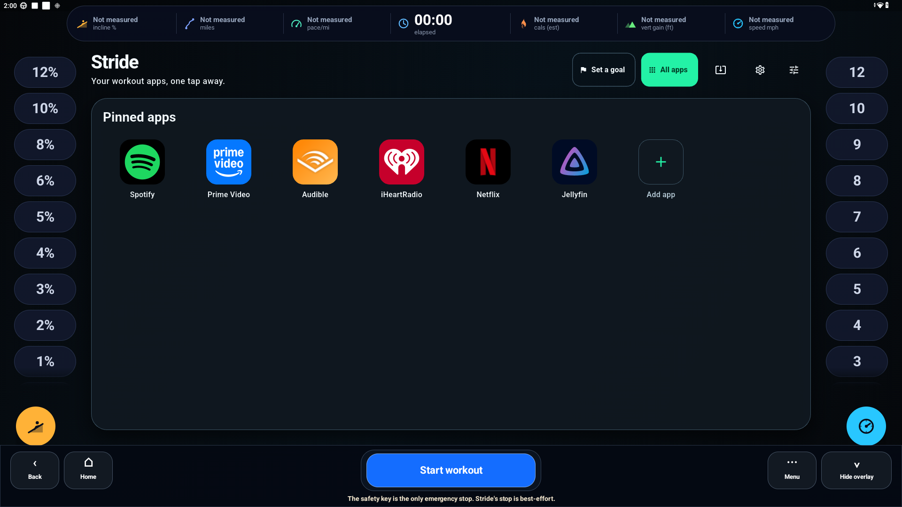
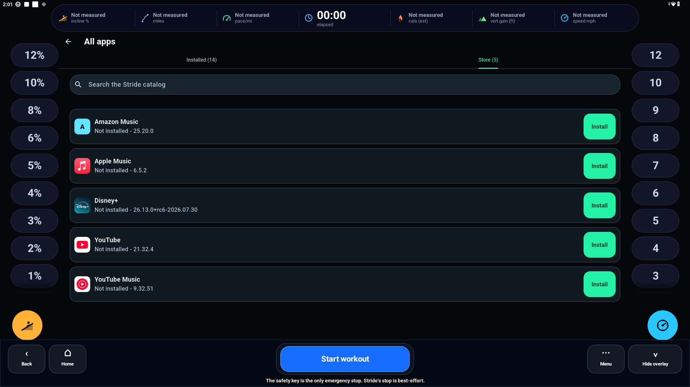
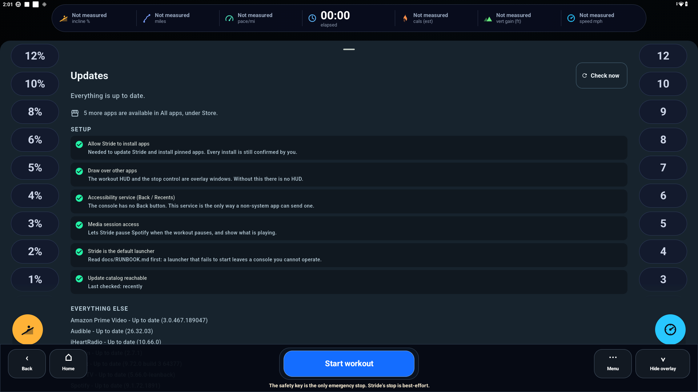
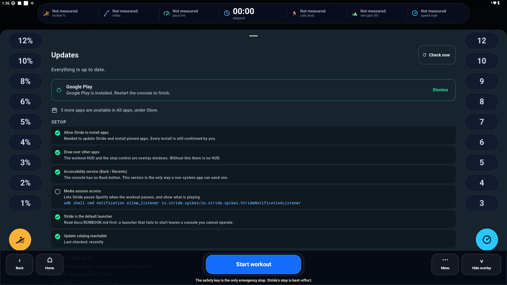

# Stride

A launcher and workout overlay that replaces the stock software on an iFit treadmill console.
This repo is what a console talks to: the update catalog, the installer, and the recovery runbook.

<p align="center">
  <a href="https://www.buymeacoffee.com/clancey"></a>
</p>

> **Tested on one machine: a NordicTrack Commercial 1750.**
> That is the only console Stride has ever run on. Other iFit machines use the same Android
> console software and will *probably* work, but nobody has tried, and the recovery step below is
> the part to read before you find out. If you do try another model, please open an issue and say
> how it went.

<p align="center">
  
</p>

## Install Stride

On your Mac or Linux machine, with the console reachable over adb:

```bash
curl -fsSL https://raw.githubusercontent.com/Clancey/stride-catalog/main/install.sh | bash
```

That downloads Stride, verifies it, installs it, and grants the permissions Stride cannot grant
itself. It prints what it is about to do and waits for you to confirm.

If the console is on your network rather than USB:

```bash
curl -fsSL https://raw.githubusercontent.com/Clancey/stride-catalog/main/install.sh | bash -s -- --connect 192.168.1.50
```

**`adb` is the only prerequisite:**

```bash
brew install --cask android-platform-tools    # macOS
sudo apt install adb                          # Debian/Ubuntu
```

That is the last time you need a laptop. From then on Stride updates itself and its apps from this
catalog, on the console, with no cable.

## What you get

| | |
|---|---|
|  | **A store.** *All apps → Store* lists what the catalog offers. Tap Install. |
|  | **Updates.** Checked on startup and every few hours. The header badges when there is something to do. |
|  | **Google Play, in one tap.** Four packages, in the right order, behind one button — and only while Play is missing. |

### Google Play

These consoles ship without Google Play, so anything that needs it — YouTube, YouTube Music —
cannot run. Stride installs the four packages Play needs, in the order it needs them, behind a
single **Install** button that only appears while something is missing.

Restart the console when it finishes. Apps that need Play become installable at that point.

## Making Stride the launcher

The installer deliberately does *not* do this, because it is the one step that can leave you with a
console you cannot operate. Try Stride first. When you are happy it starts:

```bash
curl -fsSL https://raw.githubusercontent.com/Clancey/stride-catalog/main/install.sh | bash -s -- --set-home
```

Keep adb connected the first time. If anything goes wrong, put the console's own launcher back:

```bash
adb shell cmd package set-home-activity com.ifit.standalone/.MainActivity
```

Before doing this on a machine you rely on, read [**the runbook**](docs/RUNBOOK.md) — how to get an
unbootable console back, how to kill a runaway overlay, and what to do if the belt is moving and you
cannot stop it.

## Safety

Stride controls a machine that can physically hurt someone. Two rules are enforced in the client:

- **Installs never happen while the belt is moving.** The Android install dialog is full-screen and
  would cover the stop control. Downloads continue; installs wait for the workout to end.
- **Stride never updates itself unprompted.** A self-update kills the process, and with it the
  overlay that supplies the only Back and Home this console has.

Every download is verified twice before the installer opens: SHA-256 over the bytes, and the APK's
signing certificate against the one this catalog pins. A mismatch is a hard failure, never a
warning.

**The safety key is still the only emergency stop.** Stride's stop button is best-effort software
on top of a treadmill, and nothing here changes that.

## If something goes wrong

| Symptom | Fix |
|---|---|
| `adb not found` | Install platform-tools (above). |
| `no console connected` | Enable Developer options → ADB/wireless debugging on the console, then `--connect <ip>`. |
| `more than one device` | `--device <serial>`, from `adb devices`. |
| `SHA-256 mismatch` | Refused on purpose. Re-run; if it persists, open an issue — do not force it. |
| An install never prompts | Make sure *Allow Stride to install apps* is green in the Updates sheet. |
| Console stuck after `--set-home` | `adb shell cmd package set-home-activity com.ifit.standalone/.MainActivity` |

Re-running the installer is safe: it reinstalls over the top and re-applies the grants.

## What this repo is

`catalog.json` is a static manifest that Stride's background updater reads over HTTPS. Stride's own
APKs are attached to Releases here; third-party APKs live in Cloudflare R2.

```
Stride on the console ──► raw.githubusercontent.com/.../catalog.json
                          ├─► Stride     → GitHub Releases (this repo)
                          └─► other apps → Cloudflare R2
```

Nothing here runs. It is a static file host that happens to be a git repo, so every change to what
a console will install is a reviewable commit.

Publishing a build, the `catalog.json` schema, and R2 setup are in
**[PUBLISHING.md](PUBLISHING.md)**.
